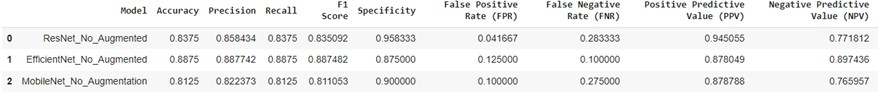
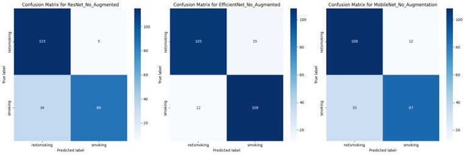
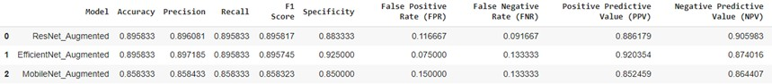
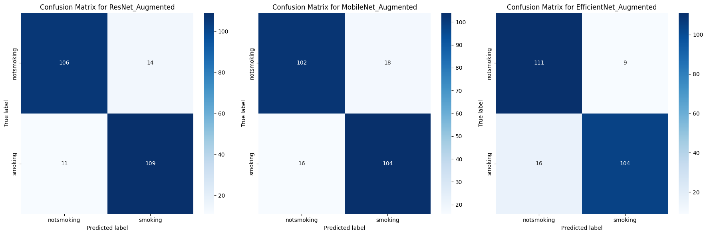
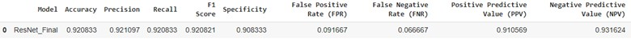
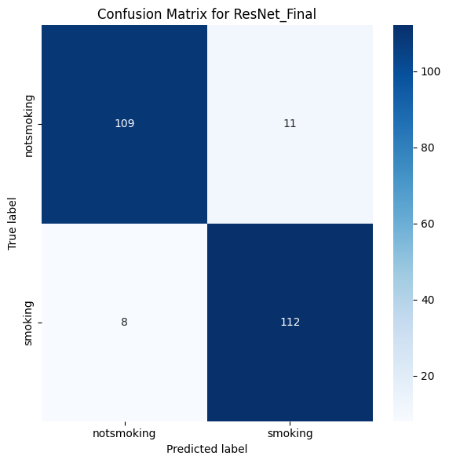

# Cigarette_Detection-Computer_Vision

Cigarette detection in photos and videos continues to be a challenging task in computer vision, having major applications in behavior analysis, public health, and security services. In order to address the inherent challenges of this issue, this research presents a novel approach for offline cigarette detection. 

In this project, we started with a CNN custom build model and then opted to use transfer-
learning solutions to ensure better performance and results.

# Data Exploration and Visualization

Our dataset is “Khan, Ali (2020)”. The dataset contains a total of 2,400 raw images.
The dataset contains a total of 2,400 raw images:
• 1,200 images in the smoking (smokers) category
• 1,200 images in the not-smoking (non-smokers) category.

The dataset is organized into directories:
• training_data (1,610 images)
• validation_data (400 images)
• testing_data (400 images).

```
There are 3 directories and 0 images in 'Dataset_New'.
There are 2 directories and 0 images in 'Dataset_New/validation_data'.
There are 0 directories and 200 images in 'Dataset_New/validation_data/notsmoking'.
There are 0 directories and 200 images in 'Dataset_New/validation_data/smoking'.
There are 1 directories and 0 images in 'Dataset_New/testing_data'.
There are 0 directories and 400 images in 'Dataset_New/testing_data/test_pictures'.
There are 2 directories and 0 images in 'Dataset_New/training_data'.
There are 0 directories and 805 images in 'Dataset_New/training_data/notsmoking'.
There are 0 directories and 805 images in 'Dataset_New/training_data/smoking'.
There are 805 images of smokers in the training Dataset_New.
There are 805 images of non-smokers in the training Dataset_New.
```
Training_data and validation_data images are labeled, while the testing_data images are
not labeled. This also decreases the number of images for the model to train on, and
therefore limit its performance.

To evaluate our models, the test images must be labeled. Therefore, the validation_data (400
labeled images) is split into two datasets, and new directories are formed: 40% new_validation
(160 labeled images) and 60% test (240 labeled images).

```
Found 160 images belonging to 2 classes.
Found 240 images belonging to 2 classes.
Training set class indices: {'notsmoking': 0, 'smoking': 1}
New validation set class indices: {'notsmoking': 0, 'smoking': 1}
Test set class indices: {'notsmoking': 0, 'smoking': 1}
```

# Data Augmentation

Due to limited data, we decided to use the data augmentation technique to compensate for the
limited data and low number of training images. We performed various augmentations such as
resizing, scaling, flipping, and shifting.

First, the images in the dataset were resized to a common resolution of 224×224. Then, random
augmentations were applied, including scaling the images by up to a factor of 0.2, rotating the
images by up to 20 degrees, and translating the images horizontally or vertically by up to 0.2.
Additionally, shear-based transformations were applied up to a factor of 0.2. The images were
also slightly rotated between 0 and 20 degrees and zoomed in by up to 0.2.

The augmented images (1610 labeled images) are then added to the original training images,
resulting in a total of 3220 labeled images.

```
Found 3220 images belonging to 2 classes.
```

After Augmentation the data looks as follows:
• training_data (3220 images)
• validation_data (160 images)
• testing_data (240 images)


<div align="center">
  
</div>


# Simulation Parameters Selection

There were several experiments conducted on three models before and after augmentation to
check the effectiveness of data augmentation. The models experimented on were ResNet50-v2,
EfficientNetB0-v2, and MobileNetV2. The parameters selected for training our model are
provided in the table below.

| Parameter      | Value           |
|-------------- |--------------- |
| Input Size    | 224 × 224      |
| Optimizer     | Adam           |
| Loss          | Binary Cross-entropy |
| Learning Rate | 0.001          |
| Batch Size    | 32             |
| Epochs        | 10             |


# Evaluation Metrics

The models were evaluated for accurate classification of smoking and not-smoking images in the
smoker detection dataset. Additionally, the models were compared on various performance
metrics such as prediction accuracy, precision, recall, specificity, positive predictive value (PPV),
negative predictive value (NPV), false negative rate (FNR), false positive rate (FPR), false
discovery rate (FDR), and F1 score. Confusion matrices were utilized to give a clearer
understanding of the model's performance, highlighting both the correct classifications and the
errors the model makes.

<table style="width: 90%; table-layout: fixed;">
  <tr>
    <td align="center">
      
    </td>
    <td align="center">
      
    </td>
  </tr>
  <tr>
    <td align="center" style="background-color: #333; color: white; padding: 10px; border-radius: 5px;">
      <strong>Smoking</strong>
    </td>
    <td align="center" style="background-color: #333; color: white; padding: 10px; border-radius: 5px;">
      <strong>Non-smoking</strong> 
    </td>
  </tr>
</table>

# Experiments

In general, data augmentation had a positive impact on the performance of the machine learning models. By increasing the variety and amount of training data, augmentation improved model accuracy, precision, recall, and F1 scores across the board. This technique also led to better generalization, as evidenced by the reduction in false negative rates (FNR) and false positive rates (FPR). 

Specifically, ResNet and MobileNet showed significant gains in accuracy and F1 scores, indicating enhanced ability to correctly classify both positive and negative instances. EfficientNet, which already performed well without augmentation, benefited from improved specificity and lower FPR, suggesting a more reliable performance in distinguishing true negatives. 


## Before Augmentation

<div align="center">
  
</div>

<div align="center">
  
</div>

## After Augmentation

<div align="center">
  
</div>

<div align="center">
  
</div>


# Focusing on ResNet

The improvement observed in ResNet through data augmentation clearly indicates that the model can achieve even better results with further modifications (additional images). Data augmentation significantly enhanced ResNet's accuracy and F1 score, showcasing its ability to leverage the increased data variability for better learning and generalization. This suggests that by continuing to augment the dataset with more diverse and representative images, ResNet's performance can be further optimized.

Therefore, another test was conducted on the ResNet model by making minimal modifications to the learning rate and the number of epochs. Below are the latest results for the modified ResNet model.


<div align="center">
  
</div>

<div align="center">
  
</div>

The metrics highlight a well-balanced and high-performing model. The accuracy, precision, recall, and F1 score are all consistently above 92%, showcasing ResNet's ability to correctly identify both positive and negative instances. The confusion matrix provides a visual representation of ResNet's performance. Out of 120 "notsmoking" images, ResNet correctly identified 111 and misclassified 9. For the "smoking" images, it correctly identified 109 out of 120, with 11 misclassifications.


# Discussion

The results suggest that ResNet's performance (in addition to EfficientNet) can continue to
improve with further data images and fine-tuning. By adding more diverse and representative
images, ResNet can enhance its ability to generalize, reducing the rates of misclassification even
further.

In general, data augmentation had a positive impact on the performance of the machine learning
models. By increasing the variety and amount of training data, augmentation improved the
evaluation metrics of most models. It is evident that by augmenting the dataset, we were able to
provide the models with more diverse examples, which helped them generalize better to unseen
data. This led to improved accuracy, precision, recall, and other evaluation metrics. 


